# Implementación de tunel estatico cloudflare (windows)
Este proyecto detalla la creacion de un tunel estatico para la exposición segura de un servidor local de carga de archivos

##  Índice
1. [Requisitos Previos](#️requisitos-previos)
2. [Instalación del Servicio](#️instalación-del-servicio)
3. [Configuración del Hostname](#️configuración-del-hostname)
4. [Errores](#errores)

---

##  Requisitos Previos
* Servidor local corriendo en el puerto 3000.
* Permisos de Administrador en la terminal.
* Salida permitida a los puertos `443` (HTTPS) y `7844` (QUIC/Argo).
* Tener un dominio disponible.

---

##  Instalación del Servicio
### Paso 1: Configuración en el Dashboard de Cloudflare
1. Crear cuenta en [Dash de Cloudflare](https://dash.cloudflare.com/).
2. Navegue a **Networking > Tunnels > Create tunnel** y despues nombrar túnel.

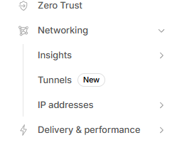
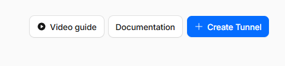 

3. Nombrar tunel.

4. Seleccionar el sistema operativo del servidor (windows 64 bit en este caso)
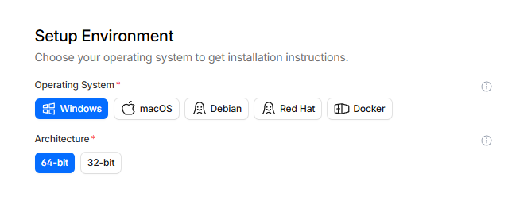 

5. Descargar y correr el ejecuble con el link que te da la pagina(cloudflared-windows-amd64.msi en este caso)

6. Abrir la terminal como administrador y correr el comando que te genera la pagina
 
Despues de correr el comando de manera exitosa debera aparecer el siguiente mensaje:
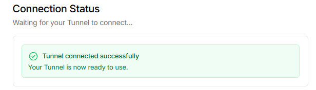 

### Paso 2: Agregar dominio a cloudflare
1. Acceder a [Dash de Cloudflare](https://dash.cloudflare.com/).
2. Ingresar a la opcion de domains del panel izquierdo

 
3. Seleccionar Onboard a domain

 
4. Ingresar el dominio y dejar las opciones por defecto

 
5. Seleccionar plan Free

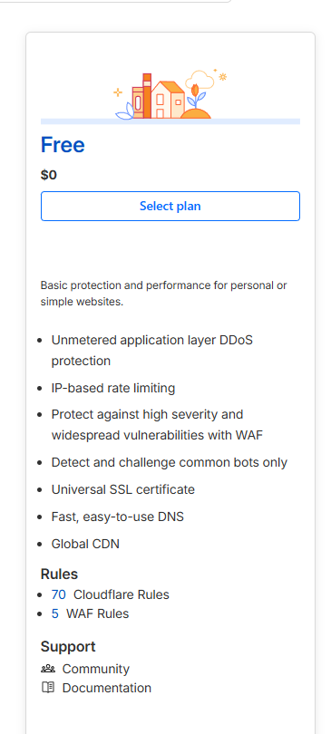 

6. Verificar que el dominio aparezca en el registro DNS y agregarlo manualmente en caso de que no aparezca
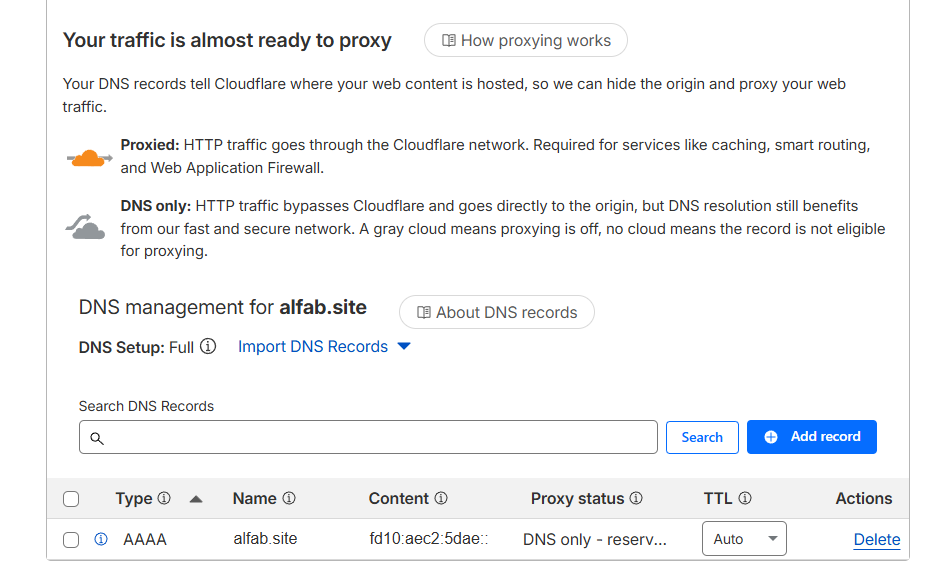 

7. Seleccionar continue to activation

8. Copiar los nameservers generados

 

9. Acceder a tu provedor de Dominio
10. Navegar a **DNS > Servidores de nombre > cambiar servidores de nombre**

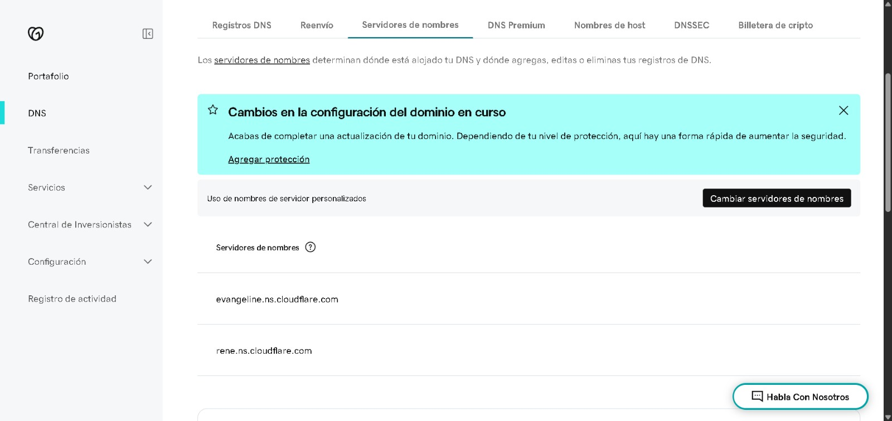 

11. Pegar los Nameservers previamente copiados y guardar

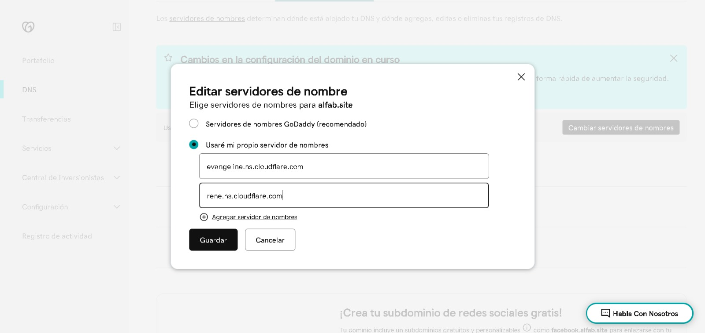 

12. Esperar a que se haga la propagacion de DNS

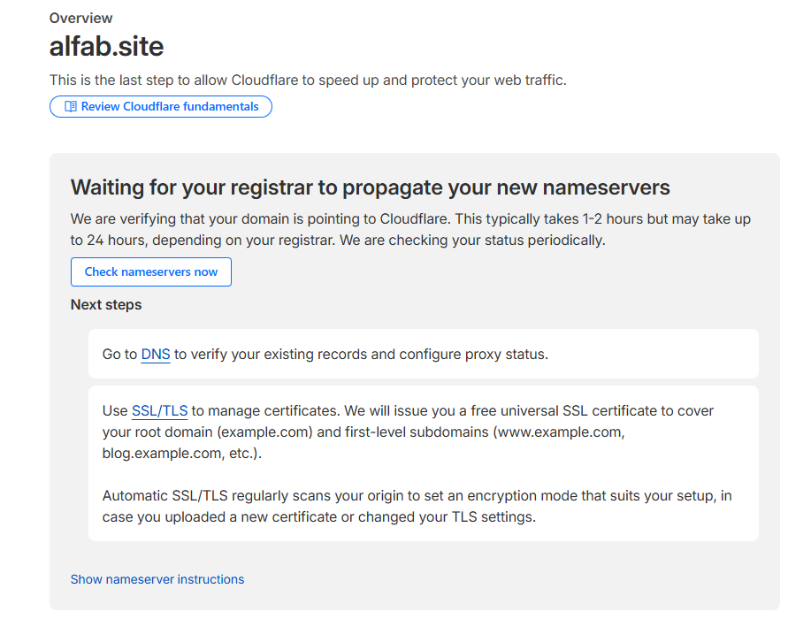 

13. Verificar que la propagacion haya terminado

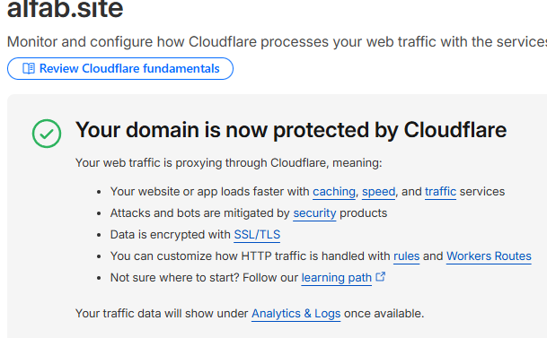 

### Paso 3: Configurar ruta hacia el servidor
1. Acceder a [Dash de Cloudflare](https://dash.cloudflare.com/).
2. Navegue a **Networking > Tunnels**.

3. Seleccionar tunel creado (deberia estar corriendo y marcando como healthy)

## Errores
### Error 1033
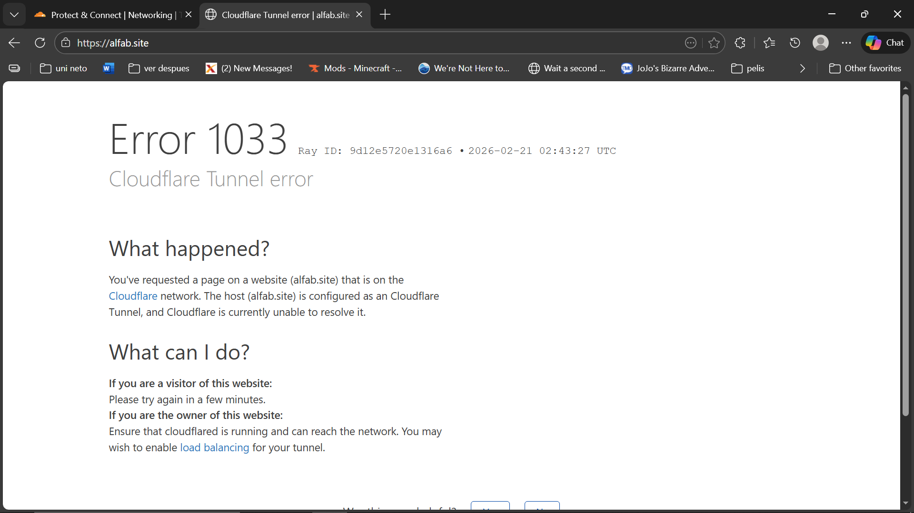 
Aparece cuando el servidor tiene un tunel corriendo diferente al que esta asignado al dominio

Solucion:

Correr el comando `cloudflared service uninstall y posteriormente correr el comamdo service install correspondiente 
